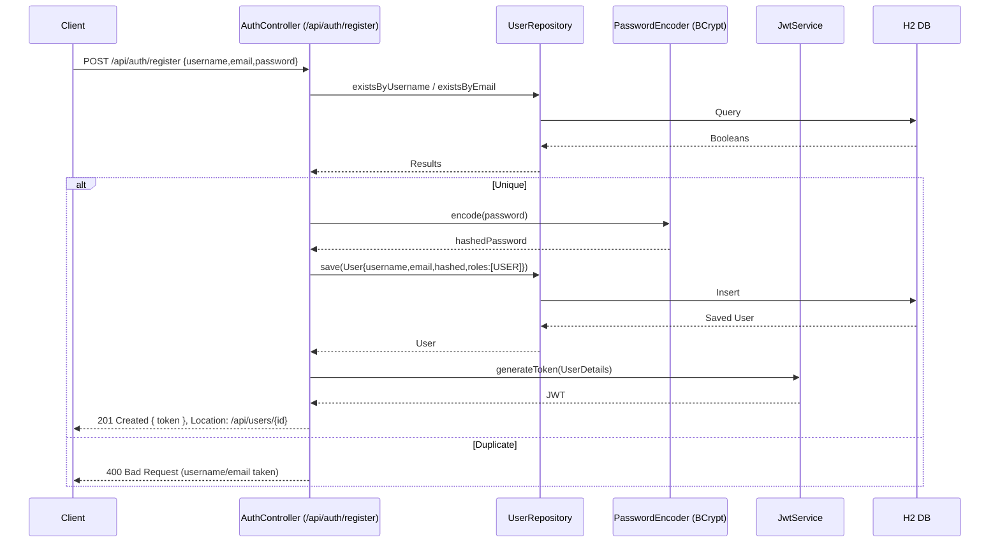
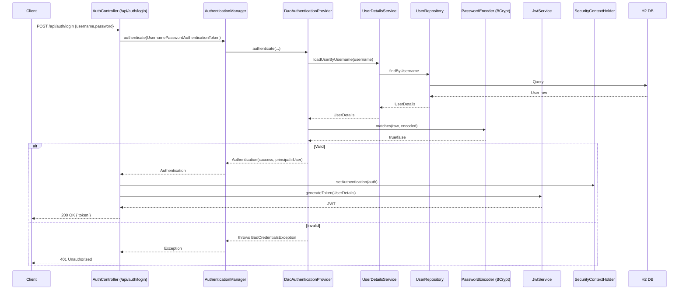
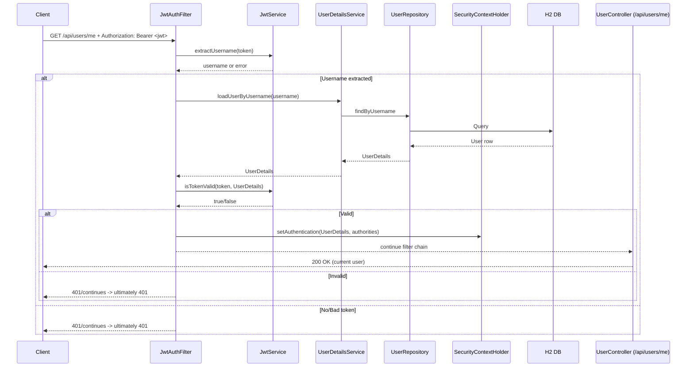
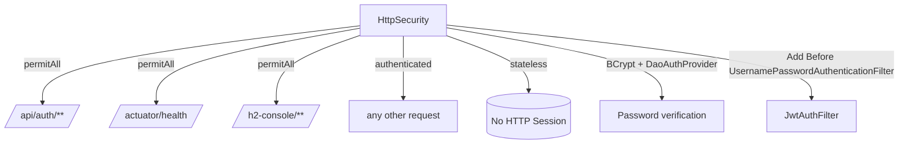

# RedLado
Build a Trading Account and Stuff Platform

## Authentication Diagrams (Mermaid)

Paste these into a Mermaid-compatible viewer (or GitHub will render them automatically if enabled) to visualize the flows.

### Register Flow


### Login Flow


## Firebase Federation (How-To)

- Overview
  - The client signs in with Firebase and receives an ID token.
  - The backend verifies that ID token via Firebase Admin and issues a local JWT.
  - Clients use the local JWT for all protected API calls (same as username/password).

- Dependencies
  - Added `com.google.firebase:firebase-admin` in `Backend/redlado/pom.xml:1`.

- Configuration
  - Generate a Firebase Service Account key (JSON) and set:
    - PowerShell: `\$env:GOOGLE_APPLICATION_CREDENTIALS="E:\\secrets\\firebase-sa.json"`
    - Bash: `export GOOGLE_APPLICATION_CREDENTIALS=/path/to/firebase-sa.json`
  - Optional CORS: set allowed origins in `Backend/redlado/src/main/resources/application.properties:1`
    - `app.cors.allowed-origins=http://localhost:3000,http://your-frontend.example`

- Backend Endpoints
  - `POST /api/auth/firebase` — body: `{ "idToken": "<firebase-id-token>" }`
    - Verifies token, finds/creates local user, returns `{ token }` (local JWT).
  - `GET /api/auth/firebase/debug?idToken=<token>` — decodes claims for debugging (dev-only; remove in prod).

- Client Example (Web)
  - After Firebase sign-in:
```
const idToken = await firebase.auth().currentUser.getIdToken(true);
const res = await fetch('/api/auth/firebase', {
  method: 'POST',
  headers: { 'Content-Type': 'application/json' },
  body: JSON.stringify({ idToken })
});
const { token } = await res.json();
// Use local JWT for API calls
await fetch('/api/users/me', { headers: { Authorization: `Bearer ${token}` } });
```

- cURL Test
```
curl -X POST http://localhost:8080/api/auth/firebase \
  -H "Content-Type: application/json" \
  -d '{"idToken":"ID_TOKEN"}'
```

- Internals
  - Firebase init: `Backend/redlado/src/main/java/com/backend/redlado/firebase/FirebaseConfig.java:1`.
  - Auth endpoint: `Backend/redlado/src/main/java/com/backend/redlado/auth/FirebaseAuthController.java:1`.
  - JWT generation unchanged: `Backend/redlado/src/main/java/com/backend/redlado/security/JwtService.java:1`.
  - CORS config bean: `Backend/redlado/src/main/java/com/backend/redlado/security/SecurityConfig.java:1`.

### Protected Request (JWT Filter)


### Security Rules

